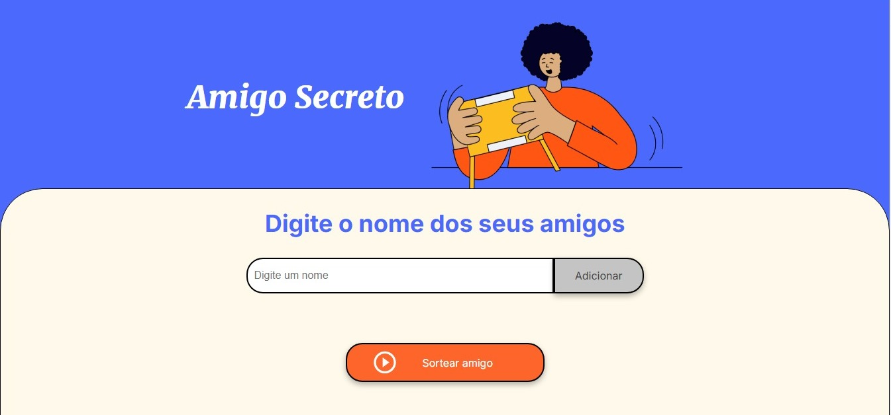

# 🎁 Challenge Amigo Secreto
## 📋 Sobre o Projeto
Um projeto desenvolvido para o desafio do curso Praticando Lógica de Programação, criando um sistema de sorteio de amigo secreto utilizando JavaScript.

Este projeto é uma aplicação web que permite organizar um sorteio de amigo secreto de forma simples e divertida. Os usuários podem adicionar participantes e realizar o sorteio de forma aleatória.

## Meu Projeto
Acesse a página web do projeto clicando no link abaixo:
[Visualizar o projeto](https://geovanigaldino.github.io/projeto-amigo-secreto/)

## 🚀 Funcionalidades

- Adicionar participantes à lista
- Validação de nomes vazios
- Validação de nomes duplicados
- Sorteio aleatório de um amigo secreto
- Exibição do amigo sorteado na tela
- 
## 🛠️ Tecnologias Utilizadas

  
  
  

## 🎯 Funcionalidades Implementadas

- Validação de entrada vazia
- Verificação de nomes duplicados
- Exibição da lista de amigos separada por vírgulas
- Sorteio aleatório de um participante
- Exibição do resultado do sorteio

## 📱 Como Usar

1. Digite o nome do participante no campo de entrada
2. Clique no botão para adicionar à lista
3. Repita o processo para todos os participantes
4. Clique no botão "Sortear" para realizar o sorteio
5. O amigo secreto sorteado será exibido na tela

Vídeo de demonstração: [Clique aqui para baixar o vídeo](video/video-tutorial-amigo-secreto.mp4)

